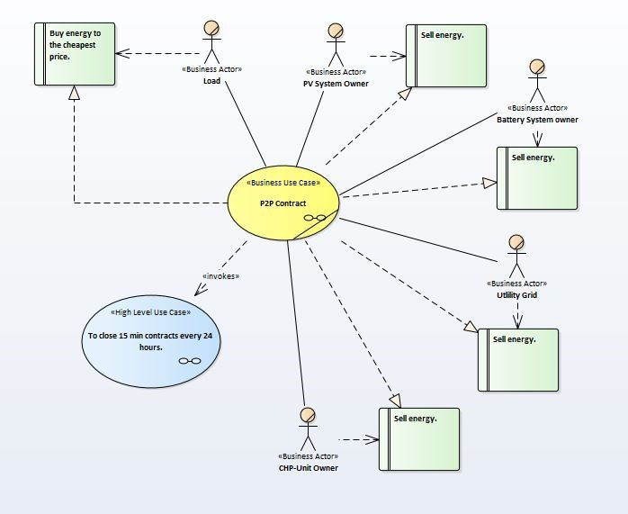

# 4. llustration of the Business Model in the SGAM

The Smart Grid Architecture Model \(SGAM\) is used to display Business Model, designed for the use in Smart Grids. The fragmentation into 5 different layers, similar to the OSI-Model which is used for network protocols, is supposed to support the identification of participating and affected actors in the energy economy. The unified modelling language \(UML\) is used for the illustration of the actors and the procedures which are implemented in the layers. Additionally, the SGAM helps the user and the involved actors to understand their role in the business model. Following the Business Use Case “Energytrading in a P2P-Network” will be explained on the basis of the Layers “Business Layer”, “Function Layer” and “Component Layer”. Eventually, with the aid of these illustrations, the business model will be implemented into a physical test model, which will be explained in Chapter 5.

### 4.1         Business Layer

Im Business Layer wird die Beziehung der Marktakteure zueinander dargestellt. Im Focus steht dabei der Business Case, also das Geschäftsmodell welches von den Akteuren verfolgt wird. Des Weiteren werden die Interessen, welche die Akteure mit den entsprechenden Business Cases verfolgen, dargestellt.

#### 4.1.1 Use Case Diagram

