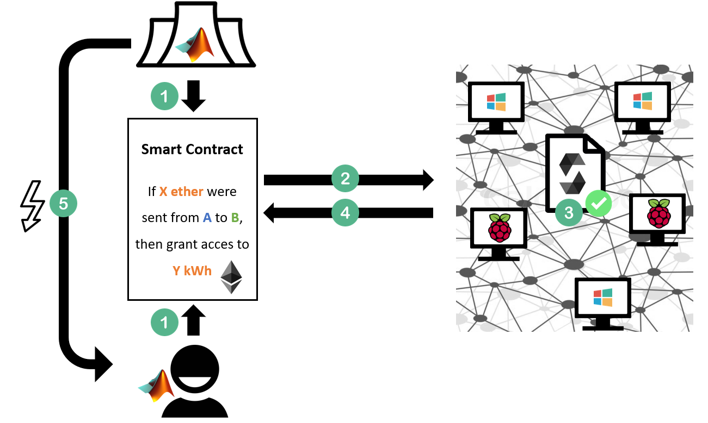
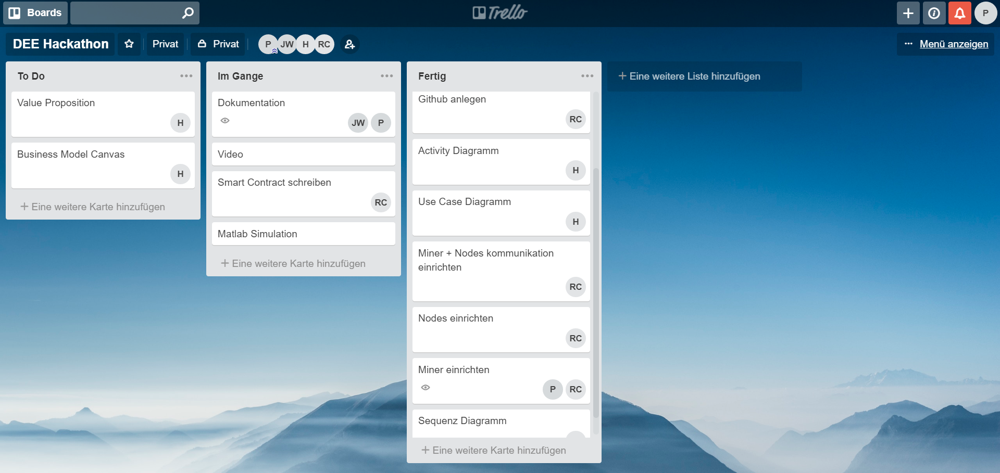

# 1. Introduction

## 1. Introduction

Seit… gewinnen DL-Technologien durch Vorfälle, welche die Konsequenzen des Versagens zentraler Strukturen aufgezeigt haben\[1\]\[2\]\[3\], zunehmend an Bedeutung. Die bekannteste Anwendung findet in der Blockchain statt, in welcher nach einem Validierungsprozess die Einträge in die DL eingetragen und durch kryptografische Signaturen miteinander verkettet werden.

### 1.1 Projektaufgabe

Die Aufgabe des Projekts bestand darin, eine private Ethereum Blockchain aufzubauen und im Rahmen eines Business Case aus der Energiewirtschaft, dieses mit fünf Nodes zu betreiben. Die fünf Knoten repräsentieren dabei Akteure in der Energiewirtschaft. Das exemplarische Netzwerk erhält dabei Daten über die Kapazität und Kosten von Strom aus einer Matlab Simulation. Auf diesen Daten basierend soll ein Smart Contract zwischen den Akteuren geschlossen werden.

### 1.2 Das Team

#### Projectmanagement, Documentation and Team Support

Das Projektmanagement muss das Vorgehen der gesamten Gruppe planen und organisieren, Aufgabenpakete zuteilen und die Kommunikation zwischen der Business und Technical sicherstellen. Zusätzlcih hat das Projektmanagement aufgrund der knappen Kapazitäten bei der Erstellung der Dokumentation und bei der technischen Umsetzung unterstützt. Hierfür waren Philipp Noack und Jan Niclas Weiss zuständig.

#### Business Case and Business Documentation

Die Gruppe Business Case and Business Documentation ist für das Erstellen des High Level Business Case und dessen Dokumentation zuständig. Hierfür werden verschiedenste Modelle wie bspw das Business Model Canvas, Activity Diagramm, Use Case Diagramme, Sequenz Diagramm und Value Proposition Canvas erstellt. Sie beschreiben damit die Ausgangslage und die übergeordnete Idee auf der die Umsetzung des Projekts basiert. Diese Aufgaben wurden von Lorenz Hajek, Patrick Klyeisen, Joey Kiefer.

#### Technical implementation and Documentation

Mitglieder der Gruppe Technical Implementation and Documentation sind dafür zuständig, die von  der Gruppe Business Case and Business Documentation erstellten Szenarien mit geeigneten Technologien und Resosurcen umzusetzen. Hierfür müssen eine Blockchain eingerichtet werden, die Kommunikation zwischen den Knoten und Minern sichergestellt werden und ein Smart Contract erstellt werden. Das Vorgehen für die Umsetzung wird in den nachfolgenden Kapiteln dokumentiert. Ricardo Czernotzky und Mustafa Satin sind hierfür zuständig.

#### Video creation and Presentation

Zum besseren Verständnis wird ein kurzes Erklärvideo und eine Präsentation erstellt, die am Ende des Hackathons vorgestellt werden. Diese Dateien umfassen das Szenario und den entsprechenden Lösungsansatz auf eine verständliche Art und Weise erläutert. Hierfür sind Rabia Karatas und Waleri Janzen verantwortlich.

#### Consulting

Zur Untersützung steht dem Team ein Experte zur Verfügung, der sich bereits vor der Veranstaltung in das Thema eingearbeitet hat. Dieser hilft hauptsächlich bei der technischen Umsetzung, aber auch bei der Kommunikation zwischen dem technisch orientierten Team und dem geschäftsorientierten Team. Hierfür war Alex Montemayor zuständig.

### 1.3 Konzeptidee

### 1.4 Vorgehen

Das Projekt wird im Rahmen eines Hackathons bearbeitet. Der Ablauf eines [Hackathons ](https://dee-scm-blockchain-project.gitbook.io/dee-scm/~/edit/drafts/-LGihJb7-sXzR68MafNF/seite-2#2-1-hackathon)wird im folgenden Kapitel noch erläutert. Es handelt sich dabei um eine agile Lernmethode im Rahmen eines temporär existierenden Labors. Hier werden Verantwortlichkeiten für den Ablauf des Projekts definiert und Aufgaben zugeteilt. Diese Aufgaben und Verantwortlichkeiten passen sich entsprechend der aktuellen Situation an und überschneiden sich.

Die Prinzipien dieser agilen Lernmethode lassen sich dabei aus den sogenannten agilen Prinzipien des "Agilen Manifests" ableiten. Ein Ausschnitt hiervon sind die schnelle Bereitstellung, Kontinuität des Lernens, cross-funktionales Lernen und Kommunikation, sowie das Bilden von Lern Teams, das Erzielen von Lernerfolgen im operativen Alltag und die Reflektion. Diese Prinzipien werden schon durch das Wesen eines Hackathons erfüllt.

An den einzelnen Tagen des Hackathons wurden die folgenden Aufgaben berarbeitet.

#### Preparation Meeting

* Teamfindung
* Rollenverteilung
* Schaffen eines einheitlichen Versändnisses für die Aufgabe
* grobe Aufgabenverteilung

#### Hackathon Tag 1

* Aufbau private Blockchain \(Raspberrys aufsetzen, Miner aufsetzen\)
* Diagramme auf Business Seite
* detaillierte Aufgabenverteilung
* Smart Contract Programmierung
* Dokumentation

#### Hackathon Tag 2

* Smart Contract Fertigstellung
* Testen der Implementierung
* Videoerstellung
* Dokumentation
* Präsentation und Abschluss

## 1.5 Projektorganisation

#### Trello

To support the project organization, the web-based project management software Trello is used. There, the first tasks were entered at the beginning, which were gradually expanded. In addition, the responsibilities were stored there and the status of the tasks was tracked.

#### WhatsApp

#### Google Drive

